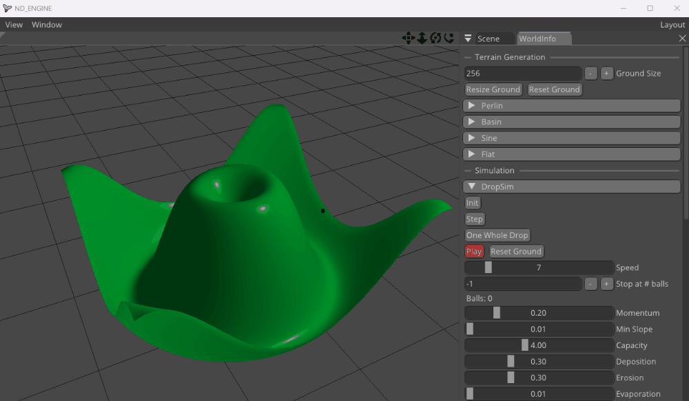
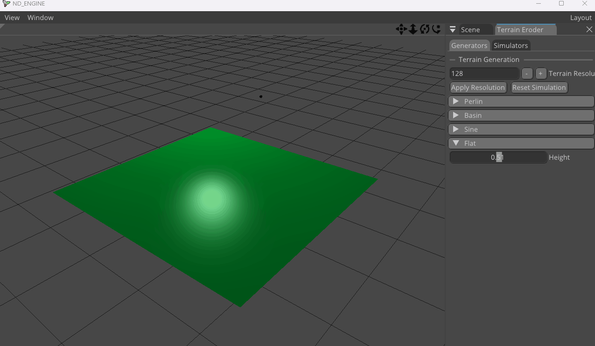
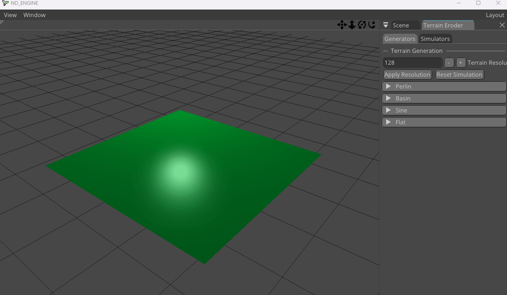

# Terrain Erosion Generator: The Manual

This tool lets you to create terrains and simulate two types of erosion: **Droplet** and **Eulerian**. It is built using the C++ NiceDay game engine.

## How to Run

Tested only on Windows, but the engine should be cross-platform. You can download the precompiled binary with all required resources or build the source code yourself. You have two options:

### a) Download the Binary

Download and run the latest release from [win_x64](https://github.com/Cooble/NiceDay/releases/tag/v1.0beta). (Recommended, contains only necessary files)

### b) or Build from Source

1. Clone the repository:

   `git clone --branch terrain --recurse-submodules --depth=1 https://github.com/Cooble/NiceDay.git`

2. In parallel, run:

   - `External-WIN32-Build.bat` (creates build directory for Visual Studio)
   - `DownloadAdditionalResources.bat` (downloads resources not part of git VCS)

3. Change to the build directory:

   - `cd build`

4. Build or open the solution:

   - `start NiceDaySolution.sln`
   - or  
     `cmake --build . --config (Debug | Release) --target SandboxTest`

5. Run the executable
   - `.\SandboxTest.exe`

## Usage

### Navigation
The UI is done with dockable ImGui, so windows can be moved, resized, or even placed on another monitor. The main window, called the "Fake Window," contains the 3D terrain scene. Navigation in 3D is handled entirely with the mouse, just like in Cinema 4D. 
In the top right corner, you'll find four navigation mode icons:
 **Move**, **Zoom**, **Rotate**, and **Rotate Around Center**. 
Click an icon, then drag with the left mouse button to use that mode:

### Generators
Before applying erosion, you need to generate a terrain. That is handled in the **Generators** tab. 
First entry allows you to set the terrain resolution, 128x128 is the default. 
(Do not forget to apply the change by clicking "Apply Resolution".) 

Next, you can choose a generator by tweaking any parameter in the said generator.
- **Perlin Noise**
- **Basin**
- **Sine**
- **Flat** (default)
- **Brush**: add height to any terrain anytime by right-clicking on the terrain in the 3D view.

### Erosion
Once you have a terrain, you can apply erosion. This is done in the **Simulators** tab.
You can manage the current simulation settings by clicking "**Load Config**" and "**Save Config**", storing them in a JSON file.

There are two types of erosion available:

---
### Droplet Erosion
simulates water droplet falling on the terrain, eroding it. The drop is depicted with the black ball in the 3D view. 
  
- To start with the simulation, generate new ball with "**Init**" button. That will spawn new droplet somewhere on the terrain.

- By clicking "**Step**" you move the simulation one step forward.
  
- After you get tired of it, "**One whole Drop**" simulates the whole drop from spawning to evaporation.

- Finally, for continuous simulation, click "**Play**".

(You can adjust any variables while simulation is running.) 

 
Following example shows increasing resolution to 256x256, creating perlin noise terrain - removing last octave, and running droplet erosion on it, increasing the simulation speed.

  

---
### Eulerian Erosion
very slow but supposedly more accurate method. It simulates water flow and sediment flow across the terrain. Very CPU intensive, meant to be run on GPU.

Once again, many parameters can be adjusted, for example:
- **Dt**: time step size, the smaller the more accurate, but slower. (high values lead to instability.)
- **Rain**: amount of rain, the higher the more water is added to the terrain.
- **Landslide**: to smooth out the terrain.

 
Following example shows picking a basin terrain, enabling rendering of water and rain simulation, running the simulation, and finally increasing the step size **Dt** (which makes the simulation less precise but faster by lowering the time resolution), and finally increasing the amount of rain.

# Implementation Details
The code is located in the SandboxTest subproject in the folder `SandboxTest/src/terrain`. The main class is `TerrainLayer`, managing render and interaction with the engine. Terrain generation is implemented in `BaseGround`. Erosion code itself is in `DropletSim` and `EulerSim`.