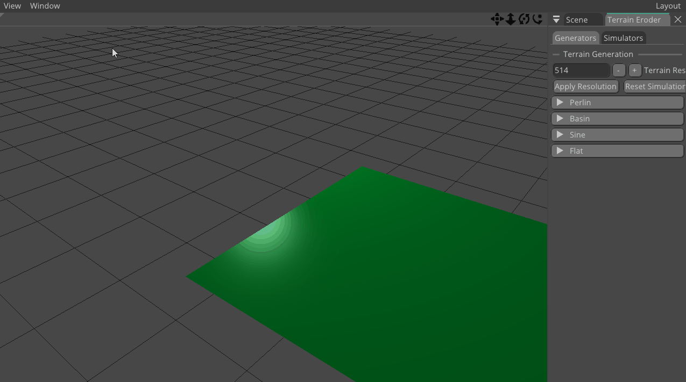
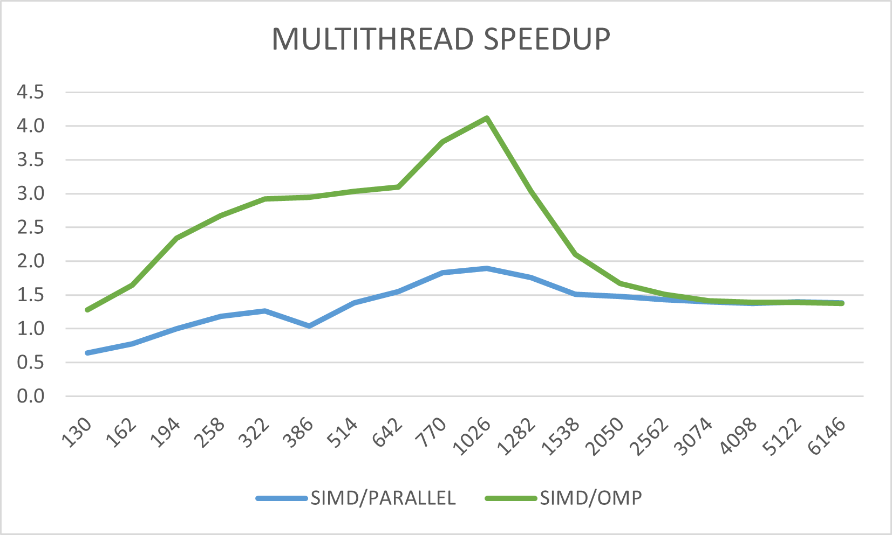
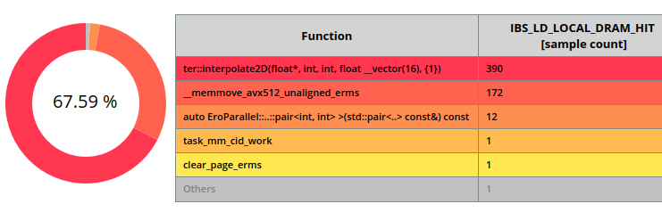
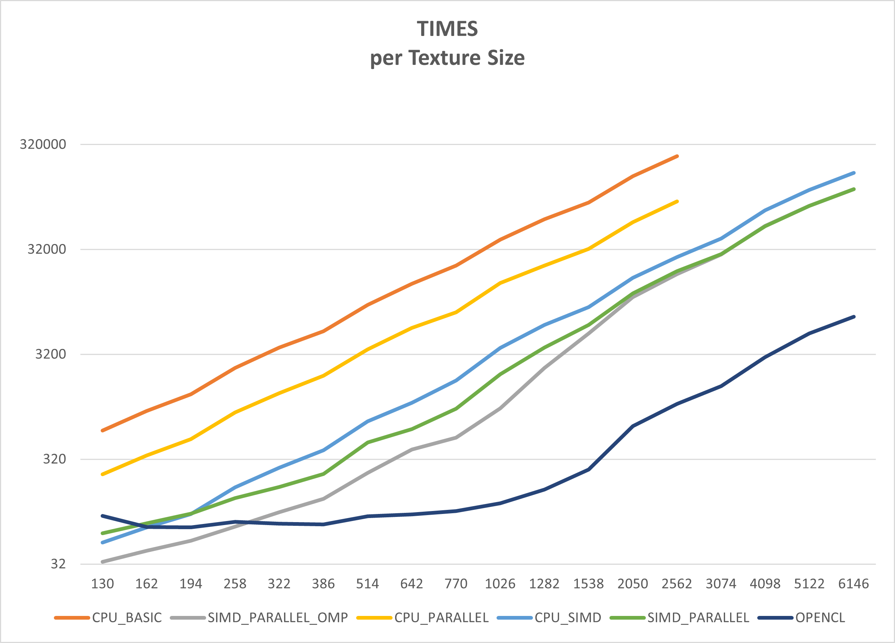

# Optimizing Terrain Eroder Simulator

# Overview
Simple eroder with two algorithm strategies was already implemented before inside the C++ ND Engine:
- **Lagrangian** approach, simulating individual droplets moving across the terrain one at the time.
- **Eulerian** approach, simulating whole fields of water and sediment across the terrain.

For the purposes of the current performance improvement the latter one was chosen as the base, as it is more computationally intensive and suitable for parallelization and vectorization.

The Eulerian approach simulates water flow and erosion in distinct steps e.g. rain addition, water flow calculation, sediment transport, evaporation...,
each step requiring at least one iteration over at least one field.

# How to Run
See `Terrain/terrain_manual/README.md` for building and running instructions or follow the steps below:

1. Clone the repository:

   `git clone --branch terrain --recurse-submodules --depth=1 https://github.com/Cooble/NiceDay.git`

2. In parallel, run:

   - `External-WIN32-Build.bat` (creates build directory for Visual Studio)
   - ~~`DownloadAdditionalResources.bat` (downloads resources not part of git VCS)~~ not needed for this module

3. Change to the build directory:

   - `cd build`

4. Build or open the solution:

   - `start NiceDaySolution.sln`
   - or  
   - `cmake --build . --config Release --target Terrain`

5. Run the executable
   - `.\build\Terrain\Terrain.exe`
   - or
   - `.\build\Terrain\Terrain.exe --help`


# Implementation

## Codebase Structure
- `Terrain/` - performance optimization project folder  
Main code files `Terrain/src/terrain/`:
  - `ero.h` - OpenCL kernel source code, works for both CPU and GPU
  - `ero_simd.h` - AVX512 vectorized CPU implementation (single-threaded, multithreaded std, multithreaded omp)
  - `EulerSim.cpp` - Represents the Euler simulator, owns resources, calls kernels
  - `cl_context.cpp` - OpenCL context management
  - `TerrainLayer.cpp` - UI, rendering, user interaction
  - `../TerrainApp.cpp` - Entry point, argument parsing

## Optimization Strategies

Before the introduction of SIMD/multithreading/GPU acceleration the computing pipeline was restructured to minimize memory accesses. (e.g. combining rain + evaporation)  
Two versions of the optimized eroder were implemented:
1. **CPU Multithreading & Vectorization**
2. **GPU OpenCL Acceleration**

### GPU OpenCL Acceleration
Utilizing the massively parallel GPU for this task is a natural fit. Even more so as the fields are 2D grids.
Implemented using OpenCL, each step of the simulation corresponds to one OpenCL kernel.
For easier debugging, the kernel source code was designed to be compilable on CPU as well thanks to MACROS.
AoS approach has been used to promote memory locality. 
For example, water flux is a float4 vector field, each component for one direction (N,E,S,W).

After the initial implementation, further optimalizations were applied:
- Initial version utilized buffer copying between steps, requiring unnecessary memory transfers.
  This was replaced with double buffering, swapping buffer pointers instead of whole buffer contents.
- Default OpenCL Command Queue In-Order-Execution has been replaced with the help of asynchronous events,
  allowing overlapping of kernel executions.

Combination of these 2 improvements led to a marginal speedup with the factor of circa 1.1x across terrain sizes. (see Results section)

### CPU Multithreading & Vectorization
The implementation targets AVX512-capable CPUs, which limits compatibility to AVX2 only systems. These would require yet another implementation to be developed from scratch.

In order to utilize CPU SIMD capabilities, the data structures had to be converted from AoS to SoA, e.g. Flux vector field -> 4 separate scalar fields.  
All major steps of the sim were vectorized with AVX512 intrinsics, operating on 16 adjacent float cells in one go.  
All branching operations were replaced to their corresponding masked operations.

Store/load operations remain unaligned, as accessing neighboring cells in a row requires unaligned accesses anyway. [ further work here, maybe load aligned and then shift-merge?]]
```cpp
   __m512 current = _mm512_loadu_ps(&g.total_height[0]);
   __m512 right   = _mm512_loadu_ps(&g.total_height[1]); // one float to the right
```
The parallelization of the CPU version proved more complex due to SIMD.
2D terrain grid had to be split into horizontal strips, each processed by one thread.
This approach, however, was not applicable to the Landslide step, which not only modifies the current cell but also its neighbors, introducing data races at the strip borders.
This step was implemented as single-threaded only for now. (Multithreading would be possible, but borders would need to be handled separately.)

Moreover, due to this locality restriction, the step had to be divided into 2 sub-passes, each modifying only half of the cells at the time (interleaved mask - checkerboard pattern).
To somewhat alleviate the performance hit, only one sub-pass is executed per simulation step leading to the slower Landslide effect.

For multithreading two approaches were tested:
1. C++ parallel `std::for_each`
2. OpenMP `#pragma omp parallel for`

Both approaches were implemented using a single header file that can be included multiple times with different preprocessor flags to generate the specific parallelization variant needed.


# UI
Two modes of running the sim:
- **Headless mode**:  
  Run simulations with parameters specified as program arguments.  
  see `./Terrain --help`  
  e.g. `./Terrain 2048 OPENCL 100` for 2048x2048 terrain on GPU, 100steps.
  For performance testing only, results are not saved.

- **Interactive mode**:  
  View and tweak simulation parameters in real-time  
  OpenCL & Vectorized CPU side by side  
  simply run without args `./Terrain`  
  (see Terrain/terrain_manual/README.md for detailed usage instructions)  
  

# Results
Performance was evaluated on a system:
- AMD Ryzen 9 9950X 16-Core Processor
- 64 GB RAM
- RTX 4090 GPU
- Win 11 OS / Ubuntu 22.04

Multiple modes were compared:
- **CPU baseline** (same code as for OpenCL kernels)
- **CPU Multithreaded**
- **CPU with AVX512 SIMD**
- **CPU Multithreaded with AVX512 SIMD**
- **GPU OpenCL**

## OpenCL
OpenCL version consistently outperformed all CPU versions. 
GPU computation times were nearly constant up to 1024x1024 terrain size, after which it started climbing linearly with the size.
The additional overhead for smaller terrains is likely due to data transfer times dominating the computation time.

What is more, additional roughly 10% speedup was achieved by introducing double buffering and asynchronous execution of OpenCL kernels:

| Size  | NEW (uS)| OLD (uS)| OLD/NEW |
|-------|---------|---------|---------|
| 8194  | 11698   | 12703   | 1.086   |
| 10242 | 18104   | 20361   | 1.125   |
| 12290 | 26031   | 29126   | 1.119   |
| 16386 | 47699   | 50923   | 1.068   |
| 20482 | 72832   | 79952   | 1.098   |

## CPU Multithreading & Vectorization

### Vectorization
Vectorized CPU version showed significant speedup over the baseline single-threaded CPU version. Over the factor of 8x. (see Speedup Factors table below)

### Multithreading
Additional improvement achieved by parallelization, however, 
the results indicate that CPU is becoming memory bandwidth bound rather quickly, as the speedup factor starts to plateau with increasing terrain sizes at about 1.4x.



This phenomenon was inspected further with the help of AMD uProf tool, revealing a high number of DRAM hits during the interpolation step, as shown below. 
This is expected, as the step requires accessing multiple neighboring cells for each cell, leading to poor cache locality.



Linux perf tool was also tried, but no useful information could be gathered from the too general cache_misses event. Further investigation is needed here. 


### Karp-Flatt Metric
The Karp-Flatt metric was calculated for two specific scenarios to evaluate the parallel efficiency of the vectorized implementation.  
OpenMP's `num_threads(n)` directive was used to control the number of threads.  
As anticipated, the results reveal a substantial serial fraction. Which can be attributed both to the not-parallelized Landslide step and memory bandwidth limitations.  
Detailed investigation of individual steps would be required to isolate the exact causes.  

Formula used for calculation:
$$e = \frac{\frac{1}{S} - \frac{1}{p}}{1 - \frac{1}{p}}$$

#### 1. Scenario: Big Data
Biggest texture tested with multithreading:
* **Size:** 8192
* **Threads ($p$):** 4 (No performance gain observed beyond 4 threads)
* **Speedup ($S$):** 1.4

$$e = \frac{\frac{1}{1.4} - \frac{1}{4}}{1 - \frac{1}{4}} = \frac{0.714 - 0.25}{0.75} = \frac{0.464}{0.75} \approx 0.62$$

#### 2. Scenario: Best Case
Best observed speedup with multithreading:
* **Size:** 1024
* **Threads ($p$):** 32
* **Speedup ($S$):** 4.0

$$e = \frac{\frac{1}{4.0} - \frac{1}{32}}{1 - \frac{1}{32}} = \frac{0.25 - 0.03125}{0.96875} = \frac{0.21875}{0.96875} \approx 0.23$$


### Speedup Factors


| Size | OMP/OPENCL | SIMD/OMP | CPU/OMP | CPU/OPENCL | CPU/SIMD |
|------|------------|----------|---------|------------|----------|
| 130  | 0.36       | 1.52     | 17.82   | 6.49       | 11.71    |
| 162  | 0.59       | 1.67     | 21.59   | 12.83      | 12.90    |
| 194  | 0.74       | 1.81     | 25.04   | 18.60      | 13.87    |
| 258  | 0.90       | 2.36     | 32.54   | 29.40      | 13.81    |
| 322  | 1.29       | 2.65     | 37.05   | 47.79      | 13.96    |
| 386  | 1.75       | 2.91     | 39.69   | 69.65      | 13.66    |
| 514  | 2.58       | 3.12     | 40.06   | 103.55     | 12.84    |
| 642  | 4.14       | 2.80     | 38.30   | 158.54     | 13.68    |
| 770  | 5.01       | 3.52     | 43.71   | 219.02     | 12.42    |
| 1026 | 8.07       | 3.77     | 40.63   | 328.06     | 10.79    |
| 1282 | 14.44      | 2.58     | 26.21   | 378.42     | 10.14    |
| 1538 | 19.85      | 1.79     | 17.67   | 350.71     | 9.89     |
| 2050 | 17.00      | 1.53     | 14.19   | 241.29     | 9.26     |
| 2562 | 17.16      | 1.46     | 13.38   | 229.65     | 9.14     |
| 3074 | 17.98      | 1.42     |         |            |          |
| 4098 | 17.85      | 1.41     |         |            |          |
| 5122 | 16.42      | 1.42     |         |            |          |
| 6146 | 16.54      | 1.43     |         |            |          |

where:
- OMP/OPENCL: Speedup of OpenCL over Multithreaded CPU
- SIMD/OMP: Speedup of AVX512 Multithreaded CPU over AVX512 Single-threaded CPU
- CPU/OMP: Speedup of AVX512 Multithreaded CPU OpenMP over Baseline Single-threaded CPU
- CPU/OPENCL: Speedup of OpenCL over Baseline Single-threaded CPU
- CPU/SIMD: Speedup of AVX512 Single-threaded CPU over Baseline Single-threaded CPU
- blank cells: not measured




# Conclusion
The terrain erosion simulator optimization project successfully achieved substantial performance improvements across multiple implementation strategies.  
**Key Achievements:**
- **Vectorization (AVX512):** Delivered over 10x speedup compared to baseline CPU implementation
- **Multithreading:** Provided additional 1.4x performance gain when combined with vectorization
- **GPU OpenCL Implementation:** Achieved 200x speedup over baseline, enabling real-time simulation of large terrains previously computationally unfeasible


# Future Work
There are still multiple areas where further improvements could be made:
- **Handle border cases better**  
  Currently, fixing borders requires more passes over the data; accessing cold memory.  
  Use SIMD with masks instead to process borders in the same pass.
- **Texture Tilling for MT**  
  Change the texture data layout
  Instead of processing Texture in horizontal strips, split it into square chunks -> promote cache locality  
  essentially Array of Structure of Arrays
- **Improve AVX implementation**  
  currently all simd load/stores are unaligned, leading loading the same data 3 times.  (e.g. load current cell + left neighbor + right neighbor separately)
  This could be mitigated by using AVX512F VALIGNQ instructions to shift/merge aligned loads.  
  Border cases would need masks though.
- **Implement AVX2 version to compare against AVX512**  
- **Evaluate compiler autovectorization**  
  Assess how well would SoA data layout enable effective compiler autovectorization
- **Optimize OpenCL render**  
  leave data on GPU: currently, every tick, the updated data is downloaded to CPU (OpenCL) and then reuploaded back to GPU (OpenGL)  
  Buffers should be shared between OpenCL and OpenGL  
